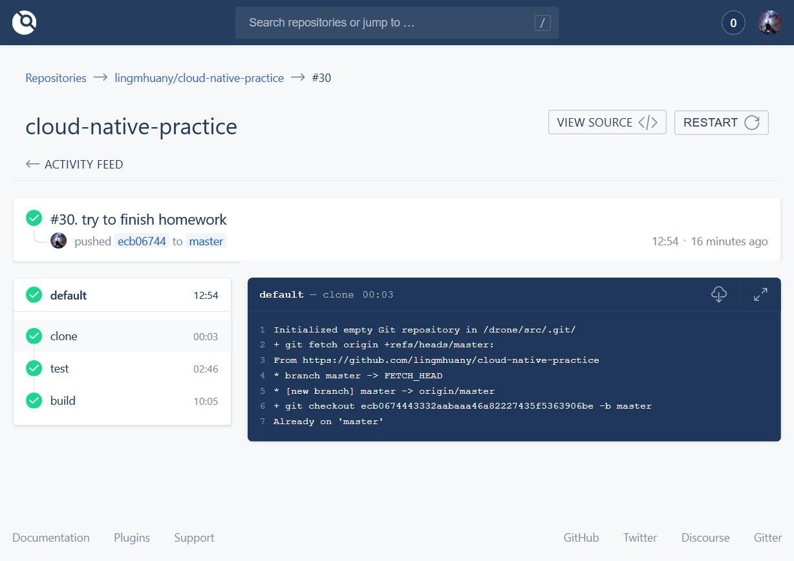

# CI Deployment Using Drone
## Introduction
We have used Drone to implement CI. The Drone server is hosted at http://47.100.191.229. I am so close to auto deployment, but sleepliness drags me into dreams.
## Steps
1. Cost a fortune to rent an Aliyun server.
2. Follow the instructions on https://docs.drone.io/installation/github/multi-machine/.
3. Follow the instructions on https://docs.drone.io/administration/agents/ to create an agent.
4. Write the `.drone.yml` file, which can be found in the root directory of this repository.
5. Dang dang dang dang, here comes the result!
